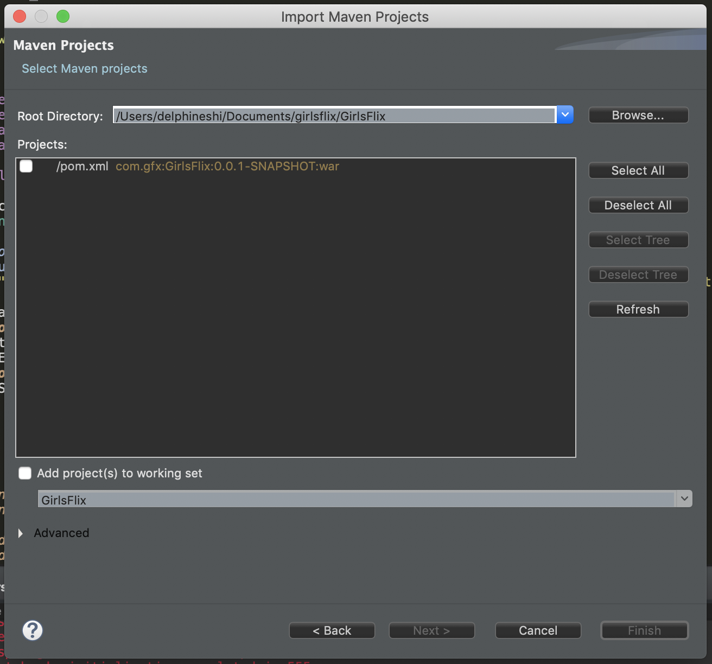
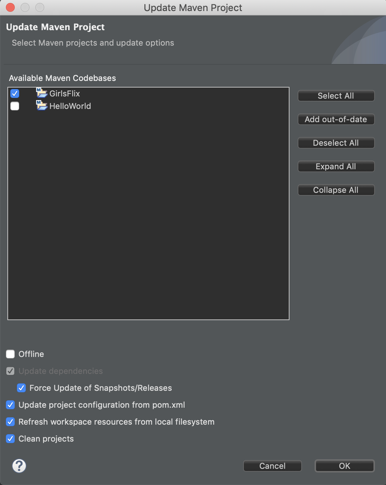
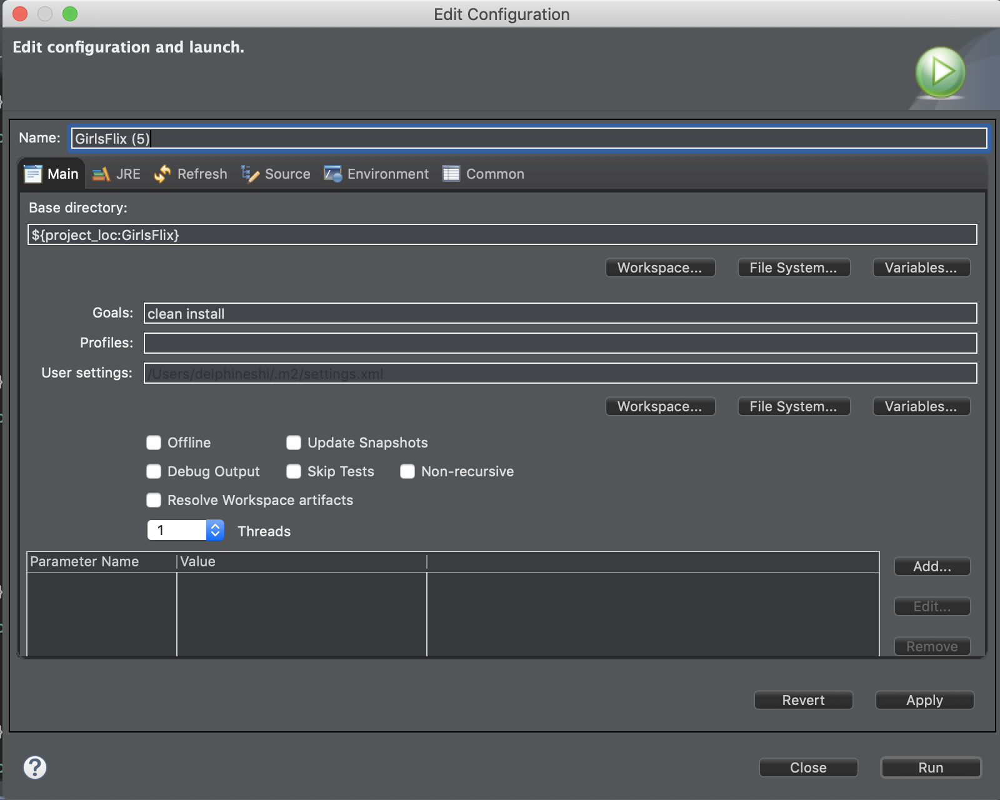
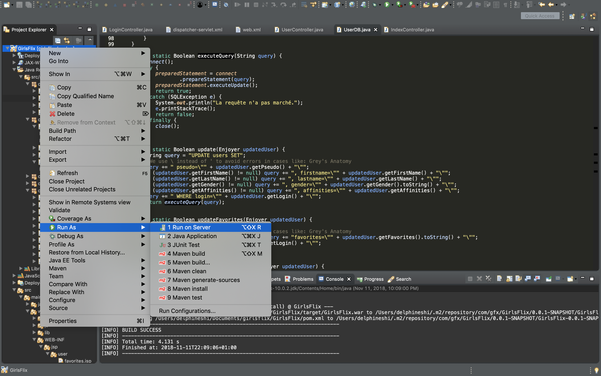
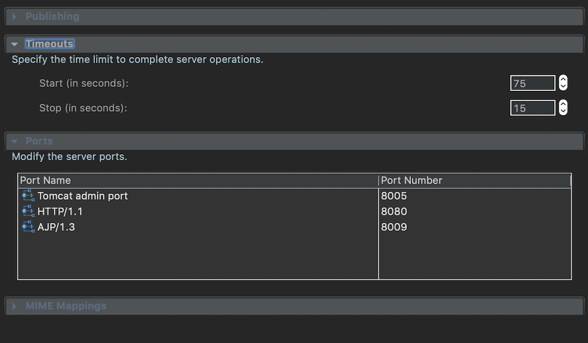
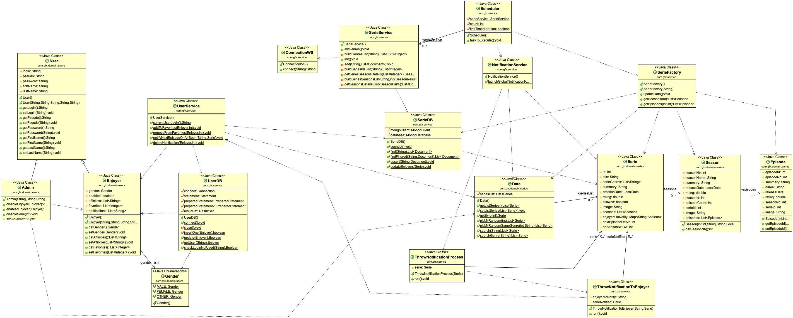

# [GirlsFlix](https://github.com/dlphn/girlsflix)

[](https://www.oracle.com/technetwork/java/javase/documentation/index.html)
[](http://maven.apache.org/)
[](https://tomcat.apache.org/)
[](https://www.themoviedb.org/documentation/api)


> GirlsFlix is a web app that allows you to search for TV series and add your favorites so you never miss any new episode.


<p align="center"></p>

## Description
It is a Java school project developed by 3 students from CentraleSupélec : Jihane, Sophie, and Delphine as part of the POOA Module.

### Features
The GirlsFlix web app allows you to:

- :tv: Browse through TV series
- :mag: Search for specific series and filter by genre
- :page_facing_up: Get details about a series
- :bust_in_silhouette: Log in to your profile and customize it
- :star2: Add your favorites
- :mailbox_with_mail: Get a notification when a new episode of one of your favorite series will be aired soon
- :gift: Be surprised with a random popular series suggestion
- :speech_balloon: Get recommendations based on your preferred genres

> If you want to test notifications quickly, try adding a series with a "Prochainement" badge. :wink:

## Installation
### Settings
Add `Keys.java` in `src/main/java/com.gfx` (ignored by Git).

```java
package com.gfx;

public class Keys {
	public static final String apiKey = "${tmdb_api_key}";
	
	public static final String mongoUser = "${mongo_user}";
	public static final String mongoPwd = "${mongo_password}";
	public static final String mongoHost = "${mongo_host}";
	public static final String mongoDb = "${mongo_db}";
	
	public static final String mysqlUser = "${mysql_user}";
	public static final String mysqlPwd = "${mysql_password}";
	public static final String mysqlHost = "${mysql_host}";
	public static final String mysqlDb = "${mysql_db}";
}
```

### Dependencies

- JDK 10.0.2 - download [latest](https://www.oracle.com/technetwork/java/javase/downloads/index.html)
- Maven 3.5.4 - download [latest](https://maven.apache.org/download.cgi)
- Tomcat 9.0.12 - download [latest](https://tomcat.apache.org/download-90.cgi)


### Start server on Eclipse
Eclipse IDE for `Java EE` Web Developers (`Photon v4.9.0`) - download [link](http://www.eclipse.org/downloads/packages/).

[Add Apache Tomcat to Eclipse](https://crunchify.com/step-by-step-guide-to-setup-and-install-apache-tomcat-server-in-eclipse-development-environment-ide/)

#### Import project to Eclipse
`File -> Import...`

`Maven -> Existing Maven Projects -> Next`

`Browse` girlsflix/GirlsFlix -> `Finish`

<p align="center"></p>


In the Project Explorer panel, Right Click on the project `GirlsFlix -> Maven -> Update Maven Project -> Force Update of Snapshots/Releases`

<p align="center"></p>


#### Build project
In the Project Explorer panel, Right Click on the project `GirlsFlix -> Run As -> Maven Build...`

Add `Goals`: `clean install`. Click `Apply` and `Run`.

<p align="center"></p>

#### Run on server
In the Project Explorer panel, Right Click on the project `GirlsFlix -> Run As -> Run on Server`

<p align="center"></p>

You can then go to [localhost:8080/GirlsFlix](http://localhost:8080/GirlsFlix) and voilà! :tada:

#### Issues you might face while starting the server

##### 1. 'Starting Tomcat v9.0 Server at localhost' has encountered a problem.
<p align="center"></p>

If you have a bad internet connection, fetching all the series from the database might take more than 45s so you will want to increase start up time.

Open the Servers view -> double click tomcat -> drop down the timeouts section -> increase Start time

<p align="center"></p>

##### 2. Red messages in Console when starting the server.
This is normal. 
The text that is in red is being written to the System.err stream, the text in black is written to System.out. Nothing is inherently wrong, that's just how the system is differentiating the output streams. You can configure the display to your liking by :
right-click in the console > "Preferences" > "Standard Error text" > Choose the color you want, for example black.
## Project structure
Technology stack:

- Java
- [Maven](http://maven.apache.org/)
- [Tomcat](http://tomcat.apache.org/)
- [Spring](http://spring.io/projects/spring-framework)
- [MongoDB](https://www.mongodb.com/)
- [MySQL](https://www.mysql.com/)
- [Bootstrap](https://getbootstrap.com/)
- [jQuery](http://jquery.com/)

### Project structure

```
src
└─ main
   ├─ java					// nos classes java
   |  └─ com
   |     └─ gfx					// com.gfx notre package de base
   |        ├─ controller			// nos controllers qui reçoivent les requêtes, utilisent les services et préparent les données renvoyées avec les vues jsp
   |        ├─ domain				// classes qui définissent notre domaine
   |        |  ├─ series			// classes qui définissent les séries
   |        |  └─ users				// classes qui définissent les utilisateurs
   |        ├─ service				// les services
   |        ├─ Config.java			// configuration générale
   |        ├─ Keys.java			// clés et mots de passe
   |        ├─ SpringConfig.java		// la configation de spring
   |        └─ SpringSecurity.java		// les profils d'exécution
   └─ webapp					// les fichiers qui vont à la racine de l'application web
      ├─ css
      ├─ js
      ├─ lib
      └─ WEB-INF
         ├─ jsp					// les templates jsp qui produisent le html
         ├─ tags				// les tag files (morceaux de template)
         ├─ dispatcher-servlet.xml		// configuration web de spring
         └─ web.xml				// configuration web d'une application
pom.xml						// fichier de configuration de maven
```

UML diagram (can be found in the `images` folder) :
<p align="center"></p>

### Spring MVC

Spring Framework for web apps.

The starting point is the `web.xml` file in `src/main/webapp/WEB-INF`. This file defines the different app configurations and uses the `dispatcher-servlet.xml` for dispatching incoming requests towards the right controllers and views.

`dispatcher-servlet.xml` also initiates the scheduled task `com.gfx.service.Scheduler` in the background, which will:

1. Update data in Mongo from the TMDB API;
2. Update the Java objects from Mongo;
3. Launch the notification process for episodes airing soon.

For now, the scheduler is set to be repeated every 5 min for testing purposes, but it is meant to be run every day early in the morning:

```xml
<property name="period" value = "300000"/>
```

### Spring Security

Handles authentication and sessions. It is configured in `com.gfx.SpringSecurity.java`.

## Contributing
Pull requests are welcome. For major changes, please open an issue first to discuss what you would like to change.

## Team
- Jihane Bennis | [jihane.bennis@student.ecp.fr](mailto:jihane.bennis@student.ecp.fr)  | [@JihaneBennis](https://github.com/JihaneBennis)
- Sophie Dambricourt | [sophie.dambricourt@student.ecp.fr](mailto:sophie.dambricourt@student.ecp.fr) | [@SophieKaramazov](https://github.com/SophieKaramazov)
- Delphine Shi | [delphine.shi@student.ecp.fr](mailto:delphine.shi@student.ecp.fr) | [@dlphn](https://github.com/dlphn)

